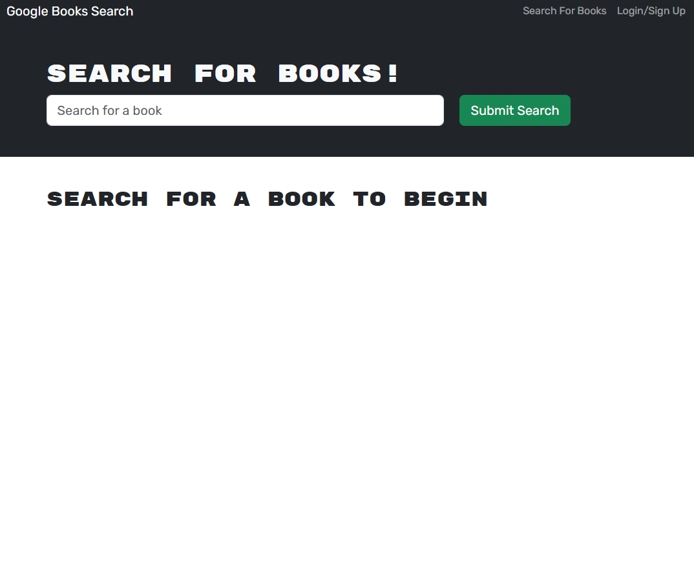
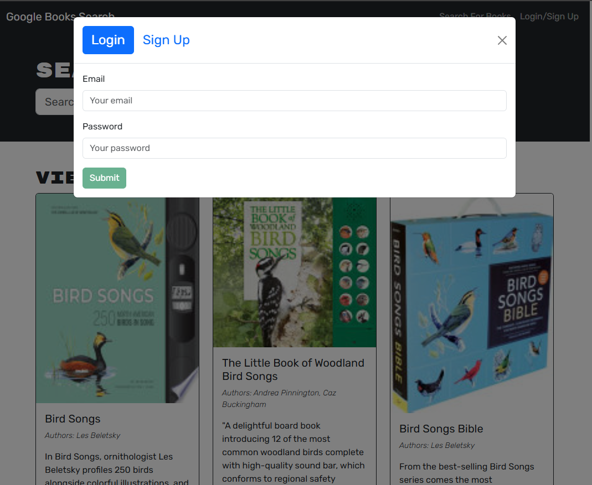
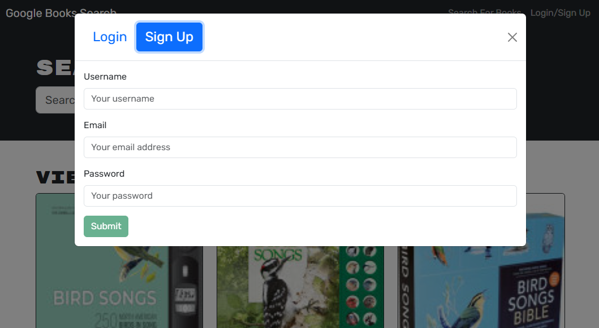
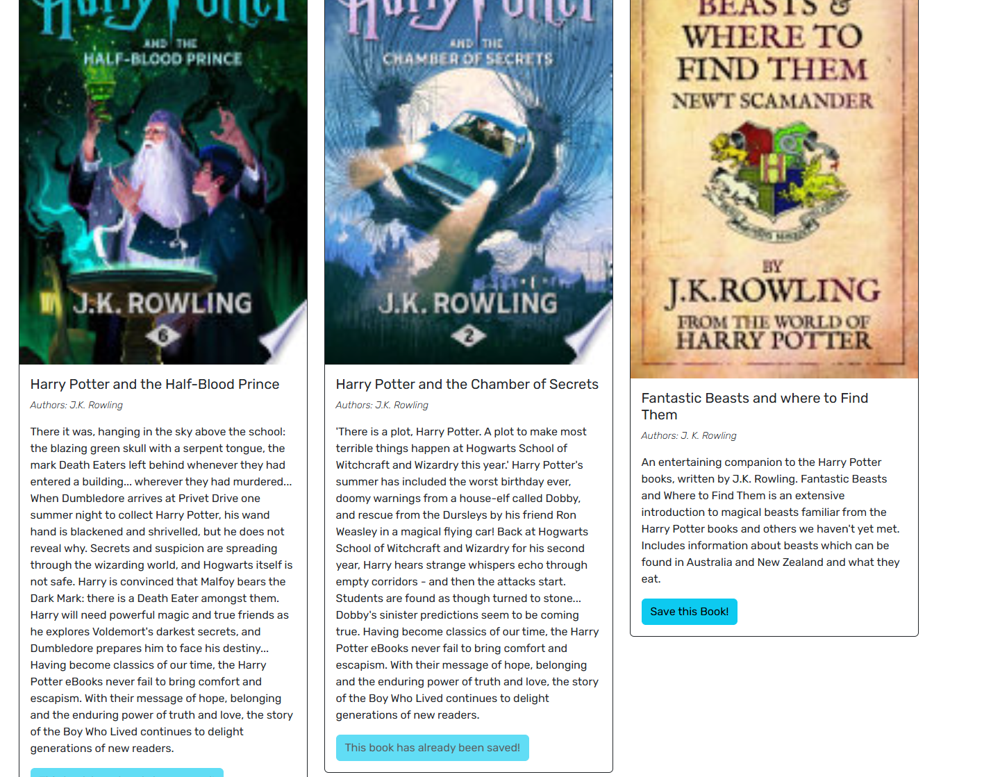
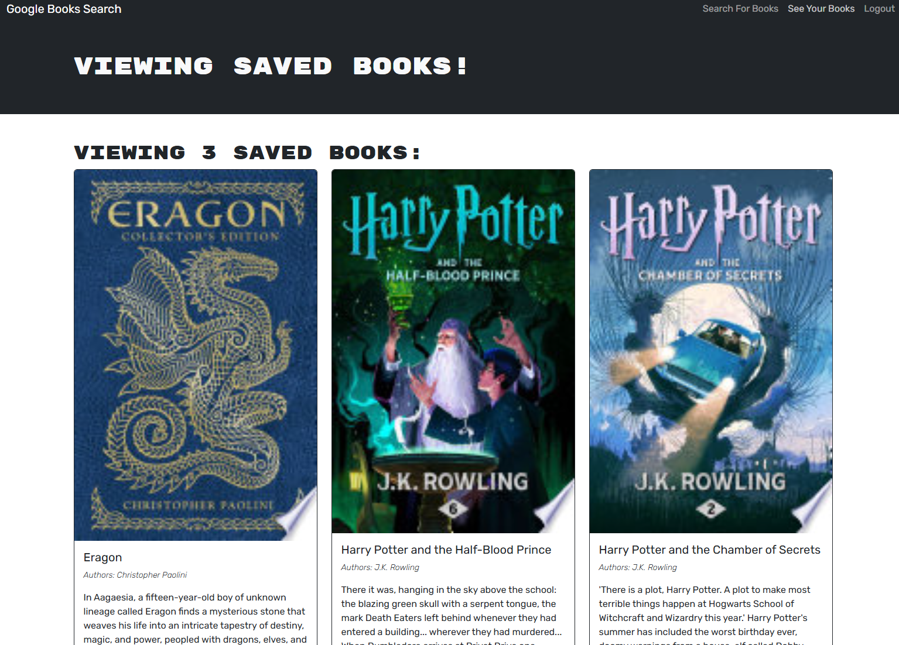

# Google Books Search Engine

A full-stack MERN (MongoDB, Express.js, React.js, Node.js) application that allows users to search for books using the Google Books API, save books to their profile, and manage their saved books. The backend is built with Apollo Server and GraphQL, and the app is deployed using Render.

## Table of Contents

- [About the Project](#about-the-project)
- [Features](#features)
- [Technologies Used](#technologies-used)
- [Getting Started](#getting-started)
  - [Prerequisites](#prerequisites)
  - [Installation](#installation)
  - [Running the Application](#running-the-application)
- [Usage](#usage)
- [Environment Variables](#environment-variables)
- [Deployment](#deployment)
- [Screenshots](#screenshots)
- [Contributing](#contributing)
- [License](#license)
- [Contact](#contact)

## About the Project

This project is a Google Books Search Engine that allows users to search for books, save them to their profile, and remove books from their saved list. The app is built using the MERN stack with Apollo Server and GraphQL for the backend API, and the frontend is built with React.

## Features

- Search for books using the Google Books API.
- Create a user account and log in to save books to your profile.
- View your saved books and remove books from your saved list.
- Responsive design for both desktop and mobile devices.
- Full authentication using JWT.

## Technologies Used

- **Frontend**: React, Apollo Client
- **Backend**: Node.js, Express.js, Apollo Server, GraphQL, MongoDB with Mongoose
- **Database**: MongoDB Atlas
- **Deployment**: Render for the backend, with static assets served via Express.js
- **Other**: JWT for authentication, Google Books API

## Getting Started

### Prerequisites

You will need to have the following installed:

- [Node.js](https://nodejs.org/)
- [MongoDB Atlas](https://www.mongodb.com/cloud/atlas) or a local MongoDB instance
- [Render](https://render.com/) or any hosting platform of your choice

### Installation

1. **Clone the Repository**:

```bash
git clone https://github.com/O-KenneDevWorks/Book-Search-Engine.git
cd google-books-search-engine
```

2. **Install Dependencies**:
Install from the root directory
```bash
npm install
```

## Running the Application

1. **Start MongoDB**: Make sure your MongoDB instance is running.

2. **Start the Application**: 
```bash
npm run start
```

The backend will run on http://localhost:3001 and the frontend on http://localhost:3001

## Usage
- Open your browser and navigate to http://localhost:3001.
- Create an account or log in.
- Use the search bar to find books from the Google Books API.
- Save books to your profile and manage them from your saved books list.

## Environment Variables
Set up the following environment variables in a .env file:
```
MONGODB_URI=your_mongodb_connection_string
JWT_SECRET_KEY=your_secret_key
```

## Deployment
The app is deployed using [Render](https://book-search-engine-oyzl.onrender.com/):

## Screenshots
Home Page


Login


Signup


Search books and Save


Saved Books


## License
Distributed under the MIT License. See LICENSE for more information.

## Questions
For any inquiries or issues, please contact:

- Name: Owen Kenne
- Email: <okenne.devworks@gmail.com>
- GitHub: [O-KenneDevWorks](https://github.com/O-KenneDevWorks/)
